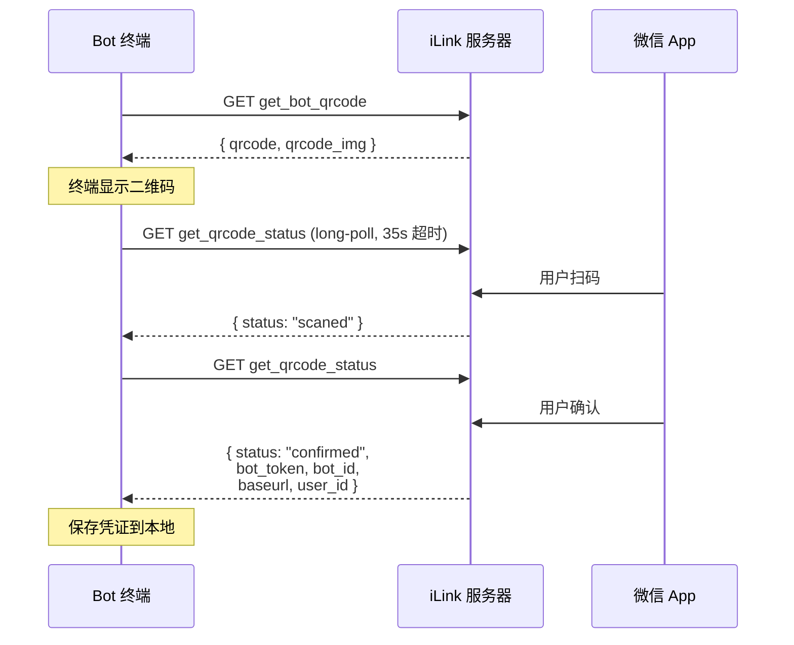

# 03 — QR 扫码登录：Bot 如何连接微信

## 登录流程

iLink 的认证选择了最符合微信用户习惯的方式：**扫码登录**。



## 两个 HTTP 端点

### 1. 获取二维码

```
GET ilink/bot/get_bot_qrcode?bot_type=3
```

返回：
- `qrcode` — 二维码内容字符串（用于状态轮询）
- `qrcode_img_content` — 二维码图片 URL（可在浏览器打开，也可在终端渲染）

`bot_type=3` 是 openclaw-weixin 这个 channel 的类型标识。

### 2. 轮询扫码状态

```
GET ilink/bot/get_qrcode_status?qrcode={qrcode}
```

这也是一个 long-poll 请求（35 秒超时），返回状态：

| 状态 | 含义 | Bot 应做什么 |
|------|------|-----------|
| `wait` | 等待扫码 | 继续轮询 |
| `scaned` | 已扫码，等待确认 | 提示用户在微信上确认 |
| `confirmed` | 确认成功 | 保存 bot_token 等凭证 |
| `expired` | 二维码过期 | 重新获取二维码（最多 3 次） |

## 关键设计细节

### 480 秒超时

二维码总超时 480 秒（8 分钟），比一般 OAuth 流程长得多。这是为了适应"用户可能不在手机旁边"的场景。

### 自动刷新

二维码过期时自动重新获取，最多刷新 3 次。不需要用户重新发起登录。

### 返回值中的关键字段

确认成功后返回：
- `bot_token` — 后续所有 API 调用的凭证
- `ilink_bot_id` — Bot 的唯一标识（格式：`xxx@im.bot`）
- `baseurl` — API 的 base URL（可能因区域不同）
- `ilink_user_id` — 扫码用户的 ID（格式：`xxx@im.wechat`）

### Token 持久化

登录成功后将凭证保存到 `~/.weixin-claude-bot/credentials.json`：

```json
{
  "botToken": "eyJ...",
  "accountId": "df412faf283b@im.bot",
  "baseUrl": "https://ilinkai.weixin.qq.com",
  "userId": "o9cq803tY5AKeBDdRlfTpUHFvtho@im.wechat",
  "savedAt": "2026-03-26T..."
}
```

文件权限设为 `0o600`（仅所有者可读写），保护 token 安全。

### Token 过期

Token 过期时，`getupdates` 会返回 `errcode=-14`。此时 Bot 应暂停 1 小时后重试，或提示用户重新登录。

## 代码实现要点

```typescript
// 终端显示二维码（用 qrcode-terminal 库）
import qrterm from "qrcode-terminal";
qrterm.generate(qr.qrcode_img_content, { small: true });

// 同时提供浏览器链接作为备选
console.log(`如无法显示，请在浏览器打开: ${qr.qrcode_img_content}`);
```

为什么用 `qrcode_img_content`（URL）而非 `qrcode`（原始内容）来生成终端二维码？因为微信扫码需要识别的是这个 URL，而非原始的 qrcode 字符串。qrcode 字符串是用于服务端轮询状态的标识。
