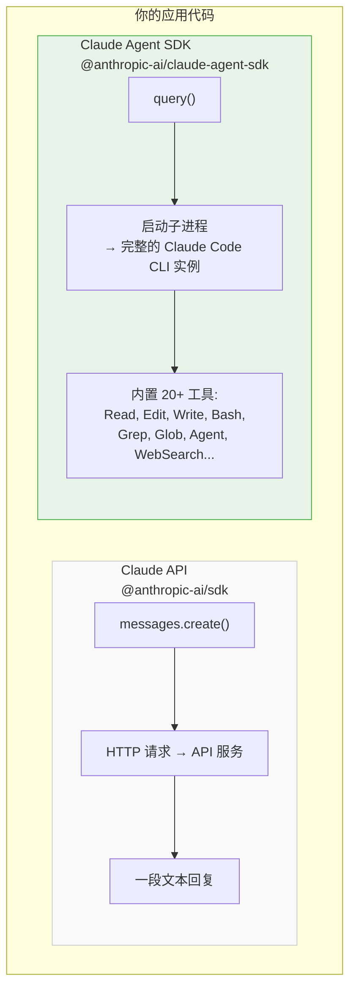
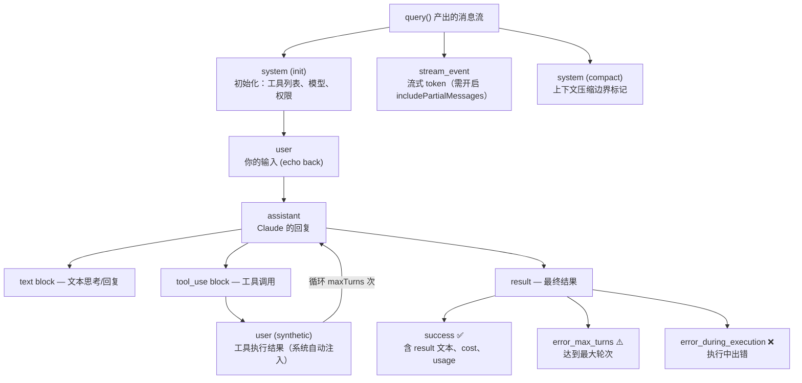
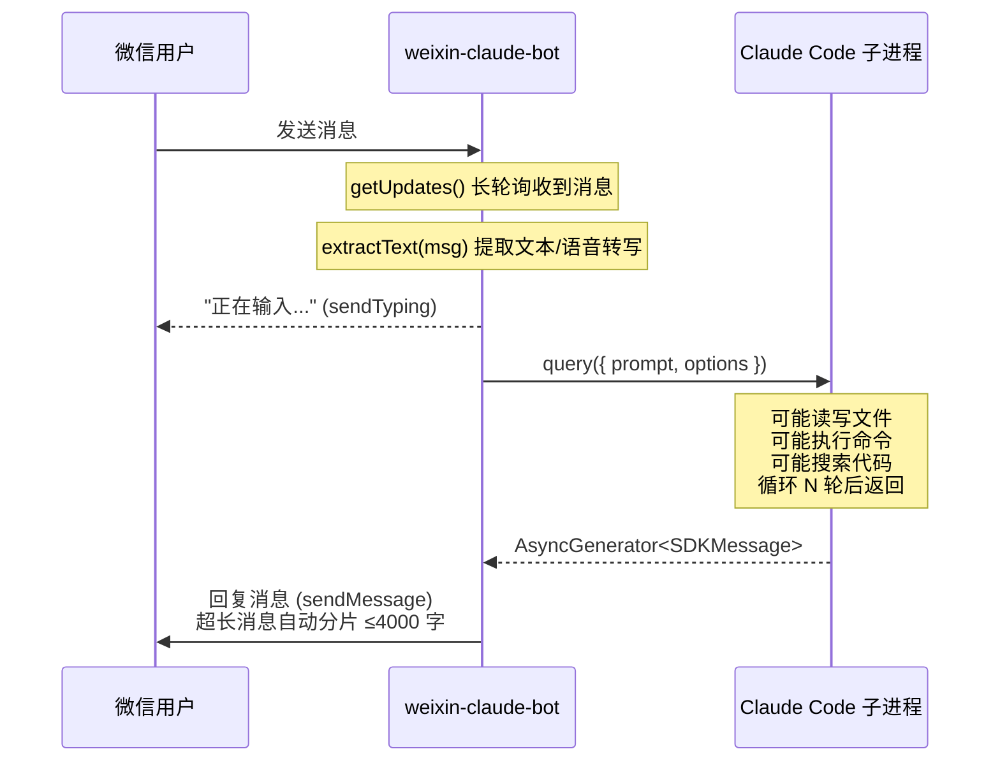

# 09 — Claude Agent SDK 深度科普：从原理到实战

> **注意**：Claude Code SDK 已更名为 **Claude Agent SDK**（2026 年 3 月），npm 包名从 `@anthropic-ai/claude-code` 改为 `@anthropic-ai/claude-agent-sdk`，同时新增了 Python SDK `claude-agent-sdk`。本文已更新为最新命名。
>
> 本文基于 weixin-claude-bot 项目的实战经验，剖析 Claude Agent SDK 的架构设计、核心 API 和使用模式。适合想把 Claude Code 能力集成到自己应用中的开发者。

## 一、先搞清楚：你在调用的到底是什么？

### Claude API vs Claude Agent SDK —— 本质区别



| | Claude API | Claude Agent SDK |
|---|---|---|
| 模式 | 纯对话：Input → Text → Output | 带 "手" 的 AI：Input → 思考 → 行动 → 观察 → 循环 |

**关键认知**：`query()` 不是发一个 HTTP 请求等结果——它启动一个**完整的 Claude Code 子进程**，这个子进程能读写文件、执行终端命令、搜索代码库、调用 MCP 工具，完成后才返回。

### npm 包的真面目

```
node_modules/@anthropic-ai/claude-agent-sdk/
├── cli.js          ← 13 MB 的单文件 bundle（完整的 Claude Code CLI）
├── sdk.mjs         ← 500 KB 的 SDK 入口（你 import 的就是这个）
├── sdk.d.ts        ← TypeScript 类型定义（唯一可读的"文档"）
├── yoga.wasm       ← 终端 UI 布局引擎
└── vendor/
    ├── ripgrep/    ← 6 个平台的 rg 二进制（搜索用）
    └── audio-capture/
```

**没有源码**。GitHub repo 只是 issue tracker + 插件仓库：
- TypeScript SDK → `anthropics/claude-agent-sdk-typescript`
- Python SDK → `anthropics/claude-agent-sdk-python`

SDK 的类型定义 `sdk.d.ts` 是你理解 API 的唯一权威参考。

---

## 二、核心 API：三件武器

SDK 只导出 3 个函数：

```typescript
export { query, tool, createSdkMcpServer } from "@anthropic-ai/claude-agent-sdk";
```

### 2.1 query() —— 一切的起点

```typescript
function query({
  prompt: string | AsyncIterable<SDKUserMessage>,
  options?: Options,
}): Query;  // Query extends AsyncGenerator<SDKMessage>
```

#### prompt 的两种形态

**形态 1：字符串（单轮对话）**

```typescript
// weixin-claude-bot 的用法 —— 每条微信消息是一次独立对话
const conversation = query({
  prompt: "帮我看看 package.json 里有哪些 scripts",
  options: { ... },
});
```

**形态 2：AsyncIterable（多轮流式对话）**

```typescript
// 交互式场景 —— 可以在对话中途追加用户消息
async function* userMessages() {
  yield { type: "user", message: { role: "user", content: "先帮我分析代码" } };
  // 等待 Claude 回复后...
  yield { type: "user", message: { role: "user", content: "再帮我重构" } };
}

const conversation = query({ prompt: userMessages(), options: { ... } });
```

> [!TIP]
> **实战选择**：weixin-claude-bot 选择了形态 1（字符串），每条微信消息是一次独立的 `query()` 调用。开启 `--multi-turn true` 后，通过 `resume` 选项传入上一次的 session ID 实现多轮对话——每次调用仍然是独立的，但 Claude 能看到之前的完整对话历史。这比 AsyncIterable 模式更适合微信场景（消息间隔不确定，进程不需要常驻等待）。

#### Options 完整解析

```typescript
type Options = {
  // ── 基础配置 ──
  model?: string;              // "claude-sonnet-4-6", "opus", "opusplan" 等
  cwd?: string;                // Claude Code 的工作目录（它能读写的根目录）
  maxTurns?: number;           // 最大 agent 循环次数（思考→工具→观察 = 1 turn）
  permissionMode?: PermissionMode;  // 权限控制

  // ── 提示词定制 ──
  appendSystemPrompt?: string;   // 追加到系统提示末尾
  customSystemPrompt?: string;   // 完全替换系统提示（慎用）

  // ── 工具控制 ──
  allowedTools?: string[];       // 工具白名单
  disallowedTools?: string[];    // 工具黑名单

  // ── MCP 扩展 ──
  mcpServers?: Record<string, McpServerConfig>;  // 注入自定义 MCP 服务器

  // ── 权限回调 ──
  canUseTool?: CanUseTool;       // 自定义权限判断函数

  // ── Hooks ──
  hooks?: Partial<Record<HookEvent, HookCallbackMatcher[]>>;

  // ── 会话管理 ──
  resume?: string;               // 恢复之前的 session ID
  resumeSessionAt?: string;      // 从指定消息处恢复
  continue?: boolean;            // 继续上一次对话
  forkSession?: boolean;         // fork 而非继续

  // ── 流式控制 ──
  includePartialMessages?: boolean;  // 是否产出流式 token 事件
  abortController?: AbortController; // 取消控制

  // ── 高级 ──
  maxThinkingTokens?: number;
  fallbackModel?: string;        // 主模型不可用时的后备
  env?: Dict<string>;            // 传入子进程的环境变量
  executable?: 'bun' | 'deno' | 'node';  // 子进程运行时
  stderr?: (data: string) => void;  // 捕获 stderr 输出
};
```

#### SDKMessage —— 消息流的 7 种类型



### 2.2 tool() —— 定义自定义工具

```typescript
function tool<Schema extends ZodRawShape>(
  name: string,
  description: string,
  inputSchema: Schema,
  handler: (args: z.infer<ZodObject<Schema>>, extra: unknown) => Promise<CallToolResult>,
): SdkMcpToolDefinition<Schema>;
```

用 Zod 定义参数，用 handler 实现逻辑。示例：

```typescript
import { tool, createSdkMcpServer, query } from "@anthropic-ai/claude-agent-sdk";
import { z } from "zod";

// 定义一个查询数据库的工具
const dbQuery = tool(
  "database_query",
  "Execute a read-only SQL query against the production database",
  { sql: z.string().describe("The SQL query to execute") },
  async ({ sql }) => {
    const rows = await db.query(sql);
    return { content: [{ type: "text", text: JSON.stringify(rows) }] };
  },
);
```

### 2.3 createSdkMcpServer() —— 进程内 MCP 服务器

```typescript
function createSdkMcpServer(options: {
  name: string;
  version?: string;
  tools?: Array<SdkMcpToolDefinition<any>>;
}): McpSdkServerConfigWithInstance;
```

把自定义工具打包成 MCP 服务器，注入 query：

```typescript
const server = createSdkMcpServer({
  name: "my-tools",
  tools: [dbQuery],
});

const conversation = query({
  prompt: "查一下用户表有多少条记录",
  options: {
    mcpServers: { "my-tools": server },
  },
});
```

> [!TIP]
> **扩展性关键**：`tool()` + `createSdkMcpServer()` 的组合让你可以给 Claude Code **注入任意能力**——查数据库、调内部 API、操控硬件——而不需要单独起一个 MCP 服务器进程。这是 SDK 相比 CLI 最大的扩展性优势。weixin-claude-bot 目前没有用这两个 API，但它们是做垂直应用的关键武器。

---

## 三、实战解析：weixin-claude-bot 怎么用的

### 3.1 整体架构



### 3.2 核心代码逐行解析

**`src/claude/handler.ts`** —— 整个项目与 SDK 交互的唯一文件（仅 76 行）

```typescript
// ① 导入：只需要 query 函数和 Options 类型
import { query } from "@anthropic-ai/claude-agent-sdk";
import type { Options } from "@anthropic-ai/claude-agent-sdk";

// ② 定义返回类型：文本 + 耗时 + 费用
export type ClaudeResponse = {
  text: string;
  durationMs: number;
  costUsd?: number;
};

// ③ 核心函数
export async function askClaude(prompt: string, opts: ClaudeOptions): Promise<ClaudeResponse> {
  const start = Date.now();
  const texts: string[] = [];
  let costUsd: number | undefined;

  // ④ 启动 query —— 这里会 fork 一个 Claude Code 子进程
  const conversation = query({
    prompt,
    options: {
      model: opts.model,             // "claude-sonnet-4-6"
      maxTurns: opts.maxTurns,       // 10（默认）
      cwd: opts.cwd,                 // 工作目录
      permissionMode: opts.permissionMode as Options["permissionMode"],
      ...(opts.systemPrompt ? { appendSystemPrompt: opts.systemPrompt } : {}),
    },
  });

  // ⑤ 消费 AsyncGenerator —— 逐条处理消息
  try {
    for await (const message of conversation) {
      if (message.type === "assistant") {
        // 收集中间的文本回复
        for (const block of message.message.content) {
          if (block.type === "text") {
            texts.push(block.text);
          }
        }
      } else if (message.type === "result") {
        // 最终结果：用 result 覆盖中间文本
        if (message.subtype === "success" && message.result) {
          texts.length = 0;          // ← 清空中间文本
          texts.push(message.result); // ← 只保留最终总结
        }
        costUsd = message.total_cost_usd;
      }
    }
  } catch (err) { /* 错误处理... */ }

  return { text: texts.join("\n").trim(), durationMs: Date.now() - start, costUsd };
}
```

> [!IMPORTANT]
> **第 ⑤ 步的 `texts.length = 0` 是一个重要的设计决策**：当 result 消息到达时，清空之前收集的所有 assistant 文本，只保留最终总结。因为在 agentic 流程中，中间的 assistant 消息可能是 "让我来读一下这个文件..." 这类过程性文本，对微信用户没有价值。而 `message.result` 是 Claude 在所有操作完成后的最终总结——这才是用户想看的。

### 3.3 消息流实例

假设用户通过微信发送：**"帮我看看 src/index.ts 有多少行代码"**

```
SDK 产出的消息流：

message #1  { type: "system", subtype: "init", tools: ["Read","Edit","Bash","Grep",...] }
            → 初始化，告诉你 Claude 准备好了哪些工具

message #2  { type: "user", message: { role: "user", content: "帮我看看..." } }
            → Echo back（你的输入）

message #3  { type: "assistant", message: { content: [
              { type: "text", text: "我来帮你查看文件行数。" },
              { type: "tool_use", name: "Bash", input: { command: "wc -l src/index.ts" } }
            ]}}
            → Claude 决定用 Bash 工具来数行数

message #4  { type: "user", message: { content: [
              { type: "tool_result", content: "276 src/index.ts" }
            ]}, isSynthetic: true }
            → 系统自动注入工具执行结果（不是用户发的）

message #5  { type: "assistant", message: { content: [
              { type: "text", text: "src/index.ts 有 276 行代码。" }
            ]}}
            → Claude 总结

message #6  { type: "result", subtype: "success",
              result: "src/index.ts 有 276 行代码。",
              total_cost_usd: 0.003,
              num_turns: 2 }
            → 最终结果：2 turns，花费 $0.003
```

在 weixin-claude-bot 中：
- message #3 的文本 "我来帮你查看文件行数。" 被收集到 `texts[]`
- message #5 的文本 "src/index.ts 有 276 行代码。" 也被收集
- message #6 到达时，`texts` 被清空，替换为 `result` 字段
- 最终发送给微信用户的是：**"src/index.ts 有 276 行代码。"**

---

## 四、权限模型：Bot 场景的核心难题

Claude Code CLI 是交互式的——每次执行危险操作都会弹窗确认。但 Bot 场景没有人在终端前面。SDK 提供了多种解决方案：

### 4.1 permissionMode 一览


| 模式 | 文件读取 | 文件编辑 | Shell 命令 | 适合场景 |
|------|---------|---------|-----------|---------|
| `plan` | Yes | No | No | 代码审查 |
| `default` | Yes | 需确认 | 需确认 | 交互式 CLI |
| `dontAsk` | Yes | 白名单内 | 白名单内 | 锁定环境 |
| `acceptEdits` | Yes | Yes | 需确认 | 半自动 |
| `auto` | Yes | Yes | AI 分类器判断 | **Bot 推荐** |
| `bypassPermissions` | Yes | Yes | Yes | 隔离容器 |

### 4.2 canUseTool 回调：自定义权限逻辑

SDK 提供了比 `permissionMode` 更精细的控制——通过 `canUseTool` 回调：

```typescript
const conversation = query({
  prompt: "...",
  options: {
    canUseTool: async (toolName, input, { signal, suggestions }) => {
      // 例：禁止删除操作
      if (toolName === "Bash" && String(input.command).includes("rm ")) {
        return { behavior: "deny", message: "Bot 不允许删除文件" };
      }
      // 例：限制只能操作特定目录
      if (toolName === "Write" && !String(input.file_path).startsWith("/safe/dir/")) {
        return { behavior: "deny", message: "只能写入 /safe/dir/" };
      }
      // 其他操作放行
      return { behavior: "allow", updatedInput: input };
    },
  },
});
```

> [!NOTE]
> **安全取舍**：weixin-claude-bot 选择了 `bypassPermissions` 作为默认模式，同时在文档中推荐 `auto`。这个取舍很实际：`bypassPermissions` 对所有账户类型都可用，而 `auto` 需要 Team plan。对于个人部署在自己机器上的 Bot，`bypassPermissions` + 限定 `cwd` 是一个务实的安全策略。但如果要对外提供服务，`canUseTool` 回调是最灵活的安全屏障。

---

## 五、Query 对象的控制方法

`query()` 返回的不只是 AsyncGenerator，它还附带了运行时控制方法：

```typescript
interface Query extends AsyncGenerator<SDKMessage> {
  interrupt(): Promise<void>;              // 中断当前执行
  setPermissionMode(mode): Promise<void>;  // 运行时切换权限
  setModel(model?: string): Promise<void>; // 运行时切换模型
  supportedCommands(): Promise<SlashCommand[]>;  // 查询可用命令
  supportedModels(): Promise<ModelInfo[]>;       // 查询可用模型
  mcpServerStatus(): Promise<McpServerStatus[]>; // MCP 服务器状态
}
```

实际应用场景：

```typescript
const conversation = query({ prompt: userMessages(), options: { ... } });

// 10 秒后如果还没完成，中断
setTimeout(() => conversation.interrupt(), 10_000);

// 根据用户输入动态切换模型
conversation.setModel("claude-opus-4-6");
```

**注意**：这些控制方法只在 AsyncIterable 输入模式下生效。weixin-claude-bot 使用字符串模式，所以没有用到这些能力。

---

## 六、Hooks 系统：拦截 Agent 行为

SDK 支持通过 Hooks 在关键节点注入自定义逻辑：

```typescript
const conversation = query({
  prompt: "...",
  options: {
    hooks: {
      PreToolUse: [{
        matcher: "Bash",  // 只拦截 Bash 工具
        hooks: [async (input, toolUseID, { signal }) => {
          // 记录所有执行的命令
          console.log(`[audit] Bash: ${input.tool_input.command}`);
          return {};  // 不干预，继续执行
        }],
      }],
      Stop: [{
        hooks: [async (input) => {
          // Claude 想停止时，可以让它继续
          return { stopReason: "请继续完成剩余的测试" };
        }],
      }],
    },
  },
});
```

### 可用的 Hook 事件

| 事件 | 触发时机 | 典型用途 |
|------|---------|---------|
| `PreToolUse` | 工具执行前 | 审计、拦截危险操作 |
| `PostToolUse` | 工具执行后 | 记录结果、触发通知 |
| `UserPromptSubmit` | 用户输入提交时 | 注入上下文 |
| `SessionStart` | 会话启动时 | 初始化设置 |
| `SessionEnd` | 会话结束时 | 清理资源 |
| `Stop` | Claude 想停止时 | 强制继续 |
| `SubagentStop` | 子 Agent 停止时 | 控制子 Agent |
| `Notification` | 通知事件 | 转发到外部系统 |
| `PreCompact` | 上下文压缩前 | 自定义压缩指令 |

---

## 七、MCP 集成：给 Claude 装上外挂

### 四种 MCP 服务器接入方式

```typescript
options: {
  mcpServers: {
    // 方式 1：Stdio（最常见，启动一个子进程）
    "file-server": {
      type: "stdio",
      command: "npx",
      args: ["-y", "@anthropic-ai/mcp-server-filesystem", "/path/to/dir"],
    },

    // 方式 2：SSE（远程服务器，Server-Sent Events）
    "remote-api": {
      type: "sse",
      url: "https://my-mcp-server.com/sse",
      headers: { Authorization: "Bearer xxx" },
    },

    // 方式 3：HTTP（远程服务器，Streamable HTTP）
    "http-api": {
      type: "http",
      url: "https://my-mcp-server.com/mcp",
    },

    // 方式 4：SDK（进程内，零开销）
    "my-tools": createSdkMcpServer({
      name: "my-tools",
      tools: [myCustomTool],
    }),
  },
}
```

> [!TIP]
> **轻量集成**：方式 4（SDK 进程内 MCP）是最轻量的集成方式——不需要额外进程，工具直接在你的 Node.js 进程中执行。如果你想给微信 Bot 加一个 "查天气" 或 "查数据库" 的能力，用 `tool()` + `createSdkMcpServer()` 几行代码就搞定，不需要单独部署 MCP 服务器。

---

## 八、Session 管理：实现多轮对话

weixin-claude-bot 目前每条消息都是独立会话，不支持上下文记忆。要实现多轮对话，SDK 提供了 `resume` 机制：

```typescript
// 第一轮对话
let sessionId: string;
const conv1 = query({ prompt: "帮我分析一下 src/index.ts", options: {} });
for await (const msg of conv1) {
  if (msg.session_id) sessionId = msg.session_id;  // 保存 session ID
}

// 第二轮对话 —— 恢复上下文
const conv2 = query({
  prompt: "刚才那个文件里的 handleMessage 函数能优化吗？",
  options: { resume: sessionId },  // ← 关键：传入上一次的 session ID
});
```

### weixin-claude-bot 中的实现

项目已支持多轮对话，通过 `--multi-turn true` 开启。核心实现：

1. **store.ts**：用 `~/.weixin-claude-bot/session-ids.json` 持久化 userId → sessionId 映射
2. **handler.ts**：`askClaude()` 接受可选 `sessionId`，传给 `query({ options: { resume } })`，并从消息流中捕获新的 session_id 返回
3. **index.ts**：在 `handleMessage()` 中串联 session 流转，支持 "新对话"/"/reset"/"/clear" 重置

```typescript
// 实际代码（简化）
const callOpts = multiTurn
  ? { ...claudeOpts, sessionId: getSessionId(fromUser) }
  : claudeOpts;

const response = await askClaude(text, callOpts);

if (multiTurn && response.sessionId) {
  setSessionId(fromUser, response.sessionId);  // 持久化到磁盘
}
```

错误时自动清除 session，避免用户卡在损坏的会话中。

---

## 九、费用与性能：微信场景的考量

### result 消息中的费用信息

```typescript
if (message.type === "result" && message.subtype === "success") {
  message.total_cost_usd;   // 本次调用总费用
  message.num_turns;         // 用了几轮
  message.duration_ms;       // 总耗时（包含工具执行时间）
  message.duration_api_ms;   // 纯 API 调用时间
  message.usage;             // Token 用量明细
  message.modelUsage;        // 按模型的用量分布
}
```

### 微信场景的典型数据

| 任务类型 | Turns | 耗时 | 费用（Sonnet） |
|---------|-------|------|---------------|
| 简单问答 | 1-2 | 5-15s | $0.001-0.005 |
| 读文件 | 2-3 | 10-20s | $0.005-0.02 |
| 改代码 | 5-10 | 30-90s | $0.02-0.10 |
| 复杂重构 | 10-30 | 2-5min | $0.10-0.50 |

### maxTurns 的权衡

```
maxTurns 过小  →  Claude 可能中途被截断，回复 "I ran out of turns"
maxTurns 过大  →  用户等太久，费用不可控
maxTurns 适中  →  weixin-claude-bot 默认 10，覆盖大部分场景
```

---

## 十、SDK 的局限性

### 目前不支持的场景

1. **无法共享 Claude Code 子进程**：每次 `query()` 都启动新进程。无法像 CLI 那样保持常驻会话（除非用 `resume`）
2. **不支持流式输出到用户**：虽然内部是流式的，但微信的消息模型是 "发一整条"，无法像终端那样逐字显示
3. **闭源 bundle**：无法修改 Claude Code 的内部行为，只能通过 options/hooks/MCP 扩展
4. **进程开销**：每次 query 启动 Node.js 子进程 + 加载 13MB bundle，冷启动有几百毫秒开销

### 与其他方案的对比

| 方案 | 优势 | 劣势 |
|------|------|------|
| **Claude Agent SDK** | 开箱即用 20+ 工具，agentic 循环 | 闭源，进程开销 |
| **Claude API + 自建 Agent** | 完全可控，可优化 | 需要自己实现工具和循环 |
| **LangChain/LlamaIndex** | 生态丰富，可换模型 | 抽象层多，调试难 |
| **OpenAI Codex** | 代码补全强 | 非 agentic，无工具调用 |

---

## 十一、从 Claude Code SDK 迁移到 Agent SDK

2026 年 3 月，Anthropic 将 Claude Code SDK 更名为 Claude Agent SDK，并引入了几个**破坏性变更**。

### 包名变更

| 语言 | 旧包名 | 新包名 |
|------|--------|--------|
| TypeScript | `@anthropic-ai/claude-code` | `@anthropic-ai/claude-agent-sdk` |
| Python | `claude-code-sdk` | `claude-agent-sdk` |

```bash
# TypeScript 迁移
npm uninstall @anthropic-ai/claude-code
npm install @anthropic-ai/claude-agent-sdk

# Python 迁移
pip uninstall claude-code-sdk
pip install claude-agent-sdk
```

### 破坏性变更 1：系统提示不再默认加载

旧版默认使用 Claude Code 的完整系统提示。新版默认使用最小提示。

```typescript
// 旧行为（v0.0.x）—— 自动带 Claude Code 系统提示
query({ prompt: "Hello" });

// 新行为（v0.1.0+）—— 需要显式指定
query({
  prompt: "Hello",
  options: {
    systemPrompt: { type: "preset", preset: "claude_code" }, // 恢复旧行为
    // 或自定义：
    // systemPrompt: "你是一个编程助手",
  },
});
```

### 破坏性变更 2：设置源不再默认加载

旧版自动读取 `CLAUDE.md`、`settings.json` 等文件系统配置。新版默认不读取。

```typescript
// 恢复旧行为
query({
  prompt: "Hello",
  options: {
    settingSources: ["user", "project", "local"],  // 显式声明
  },
});
```

### 对 weixin-claude-bot 的影响

我们的项目需要做以下迁移：
1. `package.json` 依赖从 `@anthropic-ai/claude-code` 改为 `@anthropic-ai/claude-agent-sdk`
2. `handler.ts` 的 import 路径更新
3. 如果需要 Claude Code 的完整系统提示和文件配置，需显式传入 `systemPrompt` 和 `settingSources`

---

## 附录：sdk.d.ts 速查

| 类型 | 用途 |
|------|------|
| `Options` | query 的配置项 |
| `PermissionMode` | `'default' \| 'acceptEdits' \| 'bypassPermissions' \| 'plan'` |
| `SDKMessage` | 消息联合类型（7 种） |
| `SDKAssistantMessage` | Claude 的回复 |
| `SDKResultMessage` | 最终结果（含 cost/usage） |
| `SDKSystemMessage` | 初始化信息 |
| `SDKPartialAssistantMessage` | 流式 token 事件 |
| `Query` | AsyncGenerator + 控制方法 |
| `CanUseTool` | 权限回调签名 |
| `HookEvent` | Hook 事件名枚举 |
| `McpServerConfig` | MCP 服务器配置联合类型 |
